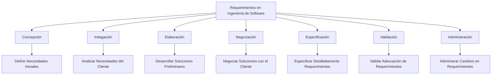

### Definición Corta
Un requerimiento es una descripción detallada de las necesidades específicas que un sistema o producto de software debe cumplir para ser considerado exitoso. Incluye aspectos como funciones, comportamientos y prioridades.

### Desarrollo del Tema
En el contexto del desarrollo de software, los requerimientos son esenciales para garantizar que el producto final cumpla con las expectativas y necesidades del cliente. La ingeniería de requerimientos es el proceso de comprender, analizar, evaluar, negociar y especificar estas necesidades, garantizando que sean claras, factibles y sin ambigüedades. Este proceso incluye varias tareas clave como concepción, indagación, elaboración, negociación, especificación, validación y administración de los requerimientos a lo largo del proyecto. Estos requerimientos juegan un papel crucial en el diseño y la construcción del software, afectando profundamente el resultado final.

### Ejemplo
Imaginemos que se está desarrollando un sistema de gestión para una biblioteca. Un requerimiento específico podría ser que el sistema debe ser capaz de gestionar el préstamo y devolución de libros de manera eficiente, permitiendo a los usuarios buscar y reservar libros en línea. Este es un ejemplo de un requerimiento que define una función clave del sistema y afecta directamente la experiencia del usuario.

### Mindmap

### Glosario
- **Ingeniería de Requerimientos**: Proceso de definir, documentar y mantener requerimientos en el desarrollo de software.
- **Especificación**: Documentación detallada de los requerimientos y necesidades de un sistema o producto de software.
- **Validación de Requerimientos**: Proceso de asegurar que los requerimientos definidos satisfacen las necesidades y expectativas del cliente.
